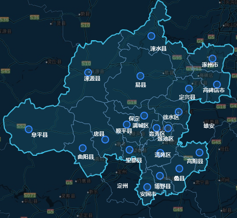

# JS地理信息处理

这篇文章会专注于用前端JS来处理地理数据。地理数据有什么可处理的呢？这应该是大有学问的。主要是关于计算机图形学的。不过我们没有必要深入学习太多这方面知识。我只是介绍一些我认为实用的东西，比如GIS中的矢量图形变换，GIS中的度量，GeoJSON的集合运算以及寻找图形的视觉中心等。将计算机图形学和GIS结合，会有很多奇妙的结果，甚至有些东西从来没人尝试过。

## 寻找图形的视觉中心

地理区域有很多中心。大家日常生活中常用的中心，一般是“行政中心”。行政中心是人为确定的，它可能在一块区域的任何位置。一般就是政府所在地。一般来说对于行政区域来说，都可以找出行政中心。不过对于一些质量不太好的数据源，或者干脆就是缺少行政中心数据的任何其他地理区域来说，我们依然会想要给它标一个标签，或者overlay一个marker，于是我们就需要找到一个合适的点。

一般在这种时候，都会提供一个centroid（几何中心）。几何中心对于形状比较正常的图形来说，一般都很合适。几何中心是一个非常符合物理学的点，但是根据我的经验，中国从不缺奇形怪状的行政区，中间挖空、好几块组成的、形状扭曲的……这些形状的centroid很容易落在边界外面，这并不符合我们标marker或者label的需要。如果标在外面，那还有什么意义呢？

所幸在地理学中有一个叫做“难抵极”（*pole of inaccessibility*）的概念，指的是多边形内距离多边形边界最远的点。Mapbox有一个叫做polylabel的开源库，运用了迭代网格算法，可以高效地计算出这个点。




这是我画的例子，可以看到像保定市涞水县、望都县，廊坊市广阳区这样的区域，都处理得很好。不过，需要注意，运用这个库的时候，需要把精度调得细一些，太粗的话会跟centroid没区别。

```js
polylabel(feature.geometry.coordinates, 0.000001)
```

得要把第二个参数写到这个程度，才能达到这种效果。

关于“难抵极”的使用，我是看到Leaflet作者Vladimir Agafonkin的下面这篇博客才了解到的。

- https://blog.mapbox.com/a-new-algorithm-for-finding-a-visual-center-of-a-polygon-7c77e6492fbc

## GeoJSON的集合操作

我这里面提到的集合操作，其实就是指MultiPolygon或者Polygon的并集、交集、异或、差集。这些操作虽然基本，但要真想自己写，就会发现，你连判断一个点在不在多边形内都不会写。但工作往往需要你立刻就能够搞出来个结果，所以不如借助一下外力。我最常用的是[geojson-clipping](https://github.com/mfogel/geojson-clipping)，不过我也知道这方面工具不只一个（下面我介绍的turf.js，也会有这个功能）。

## Turf.js，前端空间地理分析的瑞士军刀

因为我个人极简主义的原则，我一直都想要避开这些外部的库。不过，有些时候不得不去找一些工具，解决一下实际问题。Turf.js几乎是唯一一个方便使用前端技术进行各种空间地理分析的库。它的实现不一定是最快的（但相对来说，还是非常快的），但它的优势在于各种功能的整合。文档非常清晰，虽然我感觉例子不够多，但好歹每个都有例子。它分为几个部分：

- MEASUREMENT（测量）
- COORDINATE MUTATION（坐标改变）
- TRANSFORMATION（变换）
- FEATURE CONVERSION（特征变换）
- ...

总而言之，会让你操作这些地理特征变得非常容易。比如你想要的获取Web地图上的距离，如果你只借助Leaflet这种地图库，是不会得到这种功能的。但turf可以让你轻易地测量。虽然turf很好用，但如果实时计算的话，你也可以找一找有没有更快的实现。还是我刚才说的大佬Vladimir Agafonkin，他对计算机图形学用在空间地理分析中非常感兴趣，而且写了很多高效的库。

- https://github.com/mourner/projects

都在这里了。比如说我前面提到的判断一个点在不在一个多边形内，你或许可以用turf的boolean-point-in-polygon，但他的[which-polygon](https://github.com/mapbox/which-polygon)或许更快。

但turf的功能很全，我们并不是任何时候都需要实时计算地。很多时候，我们只要提前把数字算出来写死就行了。这时候完全可以利用turf的便利性，组合多种变换操作，得到你想要的效果。想要平滑就能平滑（turf.smooth），想要有棱有角也能有棱角（turf.simplify）。

## 前端处理GIS数据的意义

上篇博客我向大家介绍过了在MySQL数据库中处理GIS数据，那么为什么还需要前端处理呢？我认为主要是提供一些更灵活的功能。比如用turfjs级联多个变换，在数据库中可能就没有提供这么方便的功能。有些并不是很常用的计算可能在前端实现就好，不必在后端上更加复杂的技术（当然我不是说Java处理不了GIS数据的意思）。事实上，前端处理一般的GIS数据的消耗并不大，当然这是针对前端能接触到的数据量而言。对于数据库中的海量数据，对比或计算，我们依然要用数据库或者开发后台代码/脚本来处理。

这篇文章应该算是GIS相关的第五弹了。其实我也没想到GIS能水这么多篇。这篇算是最不走心的一篇了吧。不过依然有我想要传达给大家的经验。[∎](../ "返回首页")

