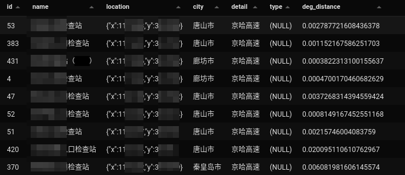

# MySQL处理GIS数据

本文所涉及的MySQL经验均以MariaDB 10.5为基础。我上周末在百忙之中重装了Deepin操作系统。因为上一次更新不知道遇到什么问题，系统启动不了。排查原因无果，于是重装最新版Deepin。问题解决。但既然是重装，我以前的软件有一些就没了。其中就包含MySQL数据库。

## 重装MariaDB过程

上次安装的部分过程我在[这篇博客](chores.html)中已经提到过了。没错，我还是用的官方脚本。毕竟Deepin是一个软件仓库更新缓慢的distro。我自然不可能因此就安装Deepin仓库里的10.3版本。毕竟10.5是一个大更新。

重装跟第一次安装的大部分步骤都是相同的。需要注意的是要把数据目录重新设定到之前的地方。我设置错了好几回，但是最终设置正确之后，MySQL就正常启动了。

我之前把数据目录放在了/home/mysql/data这个路径里。这没什么。但是我重装系统以后，数据目录的owner就变成我了，应该设置成mysql:mysql才对。总之，这都不是难事。

## 导入csv数据

这次导入csv可是让我费了劲了。如果有navicat的话应该会轻松搞定，但是在咱们清真的Linux下，我自然不可能去装什么盗版的Navicat。虽然有一个DBeaver可以使用，但我之前用它的感受不爽，不想再安装了。这次我选择了一个冷门GUI，叫做Beekeeper Studio，是一款开源软件。但是功能有点简陋，没有方便的直接导入csv。于是我尝试用语句导入。也就是`LOAD DATA`语句啦。

但是我尝试了很多次都不成功，老是卡在data truncated for column的问题。我想到印象中，我安装的MariaDB的类型验证好像是比MySQL 5.7严一些啊，于是我查了一下，应该是默认的sql_mode影响了这一点

```sql
show variables like '%sql_mode%';
```

我看了下这个值是多少

```
IGNORE_SPACE,STRICT_TRANS_TABLES,ERROR_FOR_DIVISION_BY_ZERO,NO_AUTO_CREATE_USER,NO_ENGINE_SUBSTITUTION
```

就是这个STRICT_TRANS_TABLES影响了我们。于是通过`SET GLOBAL sql_mode`把它干掉了。

当然还有其他问题，就是GIS数据类型导入的麻烦之处。

```mysql
LOAD DATA INFILE '/home/alexander/coding/map/railway_china.csv'
INTO TABLE railway_china
FIELDS TERMINATED BY ',' OPTIONALLY ENCLOSED BY '"' ESCAPED BY '\\'
LINES TERMINATED BY '\r\n'
IGNORE 1 LINES
(id, name, @var3)
SET
location = GeomFromText(@var3);
```

注意行尾符是什么很重要。如果你是Windows类的换行CRLF，一定不要写成`\n`，那样会报一个

```
Row 1 was truncated; it contained more data than there were input columns
```

这个错有各种原因都有可能引起，所以你在网上找解决方法，也容易找不对。

## 如何提高地理位置数据的准确度

我前几周没事就在想这个问题。解决这个问题无非是两个路子：一个是靠人力，一个是靠程序自动比对。本文中我主要想提的是，通过MySQL在库中排查数据中的问题。

### 通过不同来源的经纬度比对

第一方面，我想排查数据中重复的情况。尤其是在OSM这种数据集中，出现同一个地方被标了两次的情况还是蛮常见的。在其他的数据中，这类情况其实也是存在。以前，我一直思路都局限在通过名称去匹配，然后检验其他数据，包括地理位置数据。但最近我想要改改思路。我要通过地理位置去聚合，找到距离近的点。如果两个火车站的距离在1000米以内，那这件事是不是会有点奇怪呢？所以我选择了这个距离。而且我发现如果这个距离扩大到2000米以至3000米的时候，这个数据就有可能出错了。

我初步的想法是利用MySQL提供的`ST_Distance_Sphere`函数，但发现MariaDB目前不支持，要到10.5.10版本之后才会支持。我是这么写的

```sql
SELECT * FROM railway_china t1, railway_china t2
WHERE ST_Distance_Sphere(t1.location, t2.location) < 1000 AND t1.id < t2.id
```

但是既然不能用，那我也可以把距离除以111195，来近似比较距离了。

```sql
SELECT * FROM railway_china t1, railway_china t2
WHERE ST_Distance(t1.location, t2.location) < 0.009 AND t1.id < t2.id
```

但这两种方案有一个共同的问题，那就是用不上空间索引。为什么用不上索引？很简单，因为ST_Distance类的函数天生就只考虑算出一个距离，没有考虑固定其中一个，来缩小查找的范围。它的两个参数是平等的。而下面这个函数，MBRContains，天生就想着框定一个范围，所以就会用上索引。这也就是为什么我在网上找到MySQL专家写的这个写法。为了适应MBRContains，构造一个类圆的多边形，从而帮助框定范围。

```sql
SELECT * FROM railway_china t1, railway_china t2
WHERE t1.id < t2.id AND
MBRContains(polygon_circle(ST_X(t1.location), ST_Y(t1.location), 0.009, 6), t2.location)
```

但这需要编写一个polygon_circle函数。需要比较高超的SQL技术

```sql
CREATE FUNCTION polygon_circle(pX DOUBLE, pY DOUBLE, pDiameter DOUBLE, pPoints SMALLINT UNSIGNED)
-- RETURNS VARCHAR(4096) DETERMINISTIC
RETURNS POLYGON DETERMINISTIC
BEGIN

  DECLARE i SMALLINT UNSIGNED DEFAULT 0;
  DECLARE vSteps SMALLINT UNSIGNED;
  DECLARE vPolygon VARCHAR(4096) DEFAULT '';

  -- Input validation

  IF pPoints < 3 THEN
    RETURN NULL;
  END IF;
  IF pPoints > 360 THEN
    RETURN NULL;
  END IF;
  IF pPoints > 90 THEN
    RETURN NULL;
  END IF;
  if (360 % pPoints) != 0 THEN
    RETURN NULL;
  END IF;

  -- Start

  SET vSteps = 360 / pPoints;

  WHILE i < 360 DO
    SET vPolygon = CONCAT(vPolygon, (pX + (SIN(i * 2 * PI() / 360) * pDiameter)), ' ', (pY + (COS(i * 2 * PI() / 360) * pDiameter)), ', ');
    SET i = i + vSteps;
  END WHILE;

  -- Add first point again
  SET vPolygon = CONCAT("POLYGON((", vPolygon, (pX + (SIN(0 * 2 * PI() / 360) * pDiameter)), " ",  (pY + (COS(0 * 2 * PI() / 360) * pDiameter)), "))");

  -- RETURN vPolygon;
  RETURN ST_GeomFromText(vPolygon);
END;
```

### 通过与行政区划对比

行政区划的边界数据属于很容易拿到的公开数据之一，也是我们判断一个经纬度是否正确的一个基础手段。我这里展示其中一种手段给大家看，就是用现成的高德数据。高德提供了行政区划边界的接口，我们可以从DataV那里拿到数据。那我们写一段小JS来处理我们的数据吧。我提前下载好了河北省各个地市的内部区县数据，使用Deno脚本处理一下

```js
import gcoord from './gcoord/index.ts'

for (let n = 1; n < 12; n++) {
  let fileName = `13${String(n).padStart(2, '0')}00.json`;
  const text = await Deno.readTextFile('gaode_data/' + fileName);
  const geojson = JSON.parse(text);
  gcoord.transform(geojson, gcoord.GCJ02, gcoord.WGS84);
  Deno.writeTextFile(fileName, JSON.stringify(geojson));
}
```

我这次用了一个公开的库gcoord来处理高德的边界数据，因为它的介绍中说支持GeoJSON格式的转换。然后我们要做的就是入库，把这些GeoJSON导入到我们的MySQL数据库。[^turf] 然后我们随手写段Lua脚本就能导入数据库了。

[^turf]: 其实如果只是处理本地文件，不用MySQL也可以，找个JS库，比如下篇博客我会给大家介绍的turfjs就可以批量处理。我这里介绍导入数据库是为了方便处理数据库中的批量数据。

```lua
local json = require('cjson')
local fs = require('fs')

local mysql = require('mysql')
mysql.bind('mariadb')
local conn = mysql.connect('localhost', 'root', 'password', 'demo', 'utf8mb4')

local new_features = {}

local function wrap_value(a)
  if a then return '"' .. a .. '"'
  else return 'NULL' end
end

local function get_geojson(geom)
  return '{"type":"' .. geom.type .. '","coordinates":' ..
    json.encode(geom.coordinates) .. '}'
end

for name, d in fs.dir() do
  if d:attr'type' == 'file' and name:match('[.]json$') then
    io.input(name)

    local geojson = json.decode(io.read('*all'))

    for i, v in ipairs(geojson.features) do
      if v.geometry.type ~= 'Point' then
        conn:query([[INSERT INTO county_boundary (name, adcode, geom)
          VALUES (]] .. 
            wrap_value(v.properties['name']) .. ',' ..
            wrap_value(v.properties['adcode']) .. ',' ..
            [[ST_GeomFromGeoJSON(']] .. get_geojson(v.geometry) .. [[')]] ..
          [[)]])
      end
    end
  end
end
```

是不是很容易呢？记得给geom这个字段加上空间索引（先设置为非空，不然无法设置空间索引）

```sql
ALTER TABLE county_boundary MODIFY `geom` geometry NOT NULL;
ALTER TABLE county_boundary ADD SPATIAL INDEX(geom);
```

好的来看看我们用来验证的数据（部分）

| id   | name | location |
| ---- | ---- | -------- |
| 576 | 北戴河火车站 | {"x":119.426578,"y":39.856995} |
| 577 | 石家庄火车站 | {"x":114.495968,"y":38.048038} |
| 578 | 邯郸火车站 | {"x":114.482702,"y":36.609316} |
| 579 | 沧州火车站 | {"x":116.884334,"y":38.315644} |
| 580 | 衡水火车站 | {"x":115.697478,"y":37.74999} |
| 581 | 邢台火车站 | {"x":114.498746,"y":37.075952} |
| 582 | 保定火车站 | {"x":115.487222,"y":38.868748} |
| 583 | 昌黎火车站 | {"x":119.174245,"y":39.710207} |
| 584 | 任丘火车站 | {"x":116.151497,"y":38.700304} |

我们现在与之前建立好的区划边界表进行关联

```sql
SELECT t1.*, t2.name, t2.adcode FROM railway_hb_test t1 JOIN county_boundary t2
ON ST_Contains(t2.geom, t1.location)
```

我们看到结果秒出。得到的结果符合我们的预期

| id | name | location | name | adcode |
| ---- | ---- | ---- | ---- | ---- |
| 575 | 唐山火车站 | {"x":118.125417,"y":39.631415} | 路北区 | 130203 |
| 576 | 北戴河火车站 | {"x":119.426578,"y":39.856995} | 北戴河区 | 130304 |
| 577 | 石家庄火车站 | {"x":114.495968,"y":38.048038} | 长安区 | 130102 |
| 578 | 邯郸火车站 | {"x":114.482702,"y":36.609316} | 丛台区 | 130403 |
| 579 | 沧州火车站 | {"x":116.884334,"y":38.315644} | 新华区 | 130902 |
| 580 | 衡水火车站 | {"x":115.697478,"y":37.74999} | 桃城区 | 131102 |
| 581 | 邢台火车站 | {"x":114.498746,"y":37.075952} | 襄都区 | 130502 |
| 582 | 保定火车站 | {"x":115.487222,"y":38.868748} | 莲池区 | 130606 |
| 583 | 昌黎火车站 | {"x":119.174245,"y":39.710207} | 昌黎县 | 130322 |
| 584 | 任丘火车站 | {"x":116.151497,"y":38.700304} | 任丘市 | 130982 |

---

这次我主要介绍了MySQL中处理地理坐标数据的一些经验。GIS功能是现代数据库中非常有用的一项功能，常见的数据库一般都会有这方面功能，只不过大家可能没有学到或者用到。我这边算是把这方面知识简单的给大家展现一下，也只是冰山一角。



事实上我也尝试了其他不同的方法，就比如用高速公路来分析沿线的GA检查站的数据的准确性，由于数据中还额外包含道路信息，我们还可以分析经纬度距离道路的距离（如上图），我就不展开讲了。方法都一样，大家可以尝试一下自己工作中用到的数据，看看是否能够利用GIS分析，发现更多可能性。[∎](../ "返回首页")