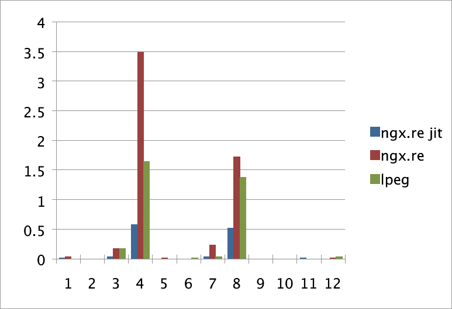

# ngx.re与lpeg的性能对比

上一周清明假期，我开始用luapower自带的nginx搞些事情。Luapower是一个非常棒的LuaJIT二进制发行版，它自带了较为完整的跨平台LuaJIT生态，对于厌恶从C编译的Lua小白（就像我这样的）来说简直是福音啊。它里面就自带了一个nginx，并且支持OpenResty的生态，这就方便了我接下来做的一个有关模式匹配引擎性能的对比。

我目前看到的OpenResty相关的模式匹配性能测评基本上都是围绕`ngx.re`（即PCRE）与lua pattern的对比。首先大家应该明白一个概念，OpenResty使用的是LuaJIT，它的lua pattern自然也是JIT加成的，所以你的ngx.re也应该开JIT参数跟它比。而开了JIT的`ngx.re`是比lua pattern稍快的。由于下面我们要比较的lpeg并非JIT版本，所以跟不加`jo`参数的`ngx.re`比较也是有意义的。

那么JIT是什么呢？我想有人不是那么了解。我为大家翻译了维基百科：

> 在[计算机技术](https://zh.wikipedia.org/wiki/计算_(计算机科学))中，**即时编译**（**JIT**，也称为**动态翻译**或**运行时编译**）是一种执行[计算机代码](https://zh.wikipedia.org/wiki/计算机代码)的方法，这种方法涉及在程序执行过程中（在[运行时](https://zh.wikipedia.org/wiki/執行期)）而不是在执行之前进行[编译](https://zh.wikipedia.org/wiki/編譯器)。通常，这包括[源代码](https://zh.wikipedia.org/wiki/源代码)或更常见的[字节码](https://zh.wikipedia.org/wiki/字节码)到[机器码](https://zh.wikipedia.org/wiki/机器语言)的转换，然后直接执行。实现JIT编译器的系统通常会不断地分析正在执行的代码，并确定代码的某些部分，在这些部分中，编译或重新编译所获得的加速将超过编译该代码的开销。

我对lpeg寄予厚望，所以自然要测一下lpeg和ngx.re比起来到底性能怎样。这里使用的数据集来自[regex-performance](https://github.com/rust-leipzig/regex-performance)里面的3200.txt文件。不过，我发现如果不加任何优化，在匹配大文件的时候，lpeg会吃亏，所以在搜索的pattern里，我加了最简单的排除法：

比如下面第三个例子，我最初的lpeg代码是

```
s <- {('Huck' / 'Saw') [a-zA-Z]+} / . s
```

这样的想法是很直接，但会造成搜索的时候，每次向后移一个字符就要再重新匹配一次s，但如果排除掉不是H和S开头的单词的话，那就减少了很多的检查。修改之后是

```
s <- {('Huck' / 'Saw') [a-zA-Z]+} / . [^HS]* s
```

## pattern代码

|  | ngx.re       | lpeg |
| ---- | ------------ | ---- |
| 1    | `Twain`      | `s <- {'Twain'} / . s` |
| 2    | `[a-z]shing` | `s <- {[a-z] 'shing'} / . s` |
| 3    | `Huck[a-zA-Z]+|Saw[a-zA-Z]+`           | `s <- {('Huck' / 'Saw') [a-zA-Z]+} / . [^HS]* s` |
| 4    | `\b\w+nn\b` | `s <- {(!'nn' %w)+ 'nn'} %W / . %w* %W* s` |
| 5    | `[a-q][^u-z]{13}x` | `s <- {[a-q] [^u-z]^13 'x'} / . s` |
| 6    | `Tom|Sawyer|Huckleberry|Finn` | `s <- {('Tom' / 'Sawyer' / 'Huckleberry' / 'Finn')} / . s` |
| 7    | `.{2,4}(Tom|Sawyer|Huckleberry|Finn)` | `s <- {.^2 .^-2 ('Tom' / 'Sawyer' / 'Huckleberry' / 'Finn')} / . s` |
| 8    | `Tom.{10,25}river|river.{10,25}Tom` | `s <- {'Tom' .^10 t1} / {'river' .^10 t2} / .^15 [^Tr]* s`<br>`t1 <- (!'river' .)^-15 'river'`<br>`t2 <- (!'Tom' .)^-15 'Tom'` |
| 9   | `[a-z]+ing` | `s <- { t } / . s`<br>`t <- [a-zA-Z] (!'ing' [a-zA-Z])* 'ing'` |
| 10   | `\s[a-zA-Z]{0,12}ing\s` | `s <- { %s t %s } / . s`<br>`t <- (!'ing' [a-zA-Z])^-12 'ing'` |
| 11 | `["'][^"']{0,30}[?!.]["']` | `s <- {["'][^"'] (!t .)^-30 t} / . [^"']* s`<br>`t <- [?!.]["']` |
| 12 | `\u{221E}|\u{2713}` | `s <- {'\u{221E}' / '\u{2713}'} / . [^\226]* s` |

## nginx配置

我使用了最基础的nginx配置（因为我是nginx的新手）。不过做这个测试应该已经足够了。`error_log`我设置成了info等级，方便我调试代码（因为`print`函数默认会打info等级的日志，我还不太常用`ngx.log`）

```nginx
worker_processes  1;
error_log logs/error.log info;
events {
    worker_connections 1024;
}

http {
    server {
        listen 6699;
        location = / {
            charset UTF-8;
            content_by_lua_file test.lua;
        }
    }
}
```

## 测试结果

纵坐标单位是秒（越少越好），显示的是上述pattern执行次数是100次的时间。



可以看出我们的lpeg还是很争气的，性能要比没有JIT加成的PCRE好一些。不过，在JIT加成后的PCRE比起来，还是有差距。但我想，如果lpeg也用JIT的方法把它的VM（lpeg本身是先翻译成bytecode，再在VM里执行的）重写一下，性能超过PCRE JIT应该是没有问题的。而且，大家可以发现，lpeg可以进行一些针对性的优化，而正则的话，想要优化可能并不容易。[∎](../ "返回首页")