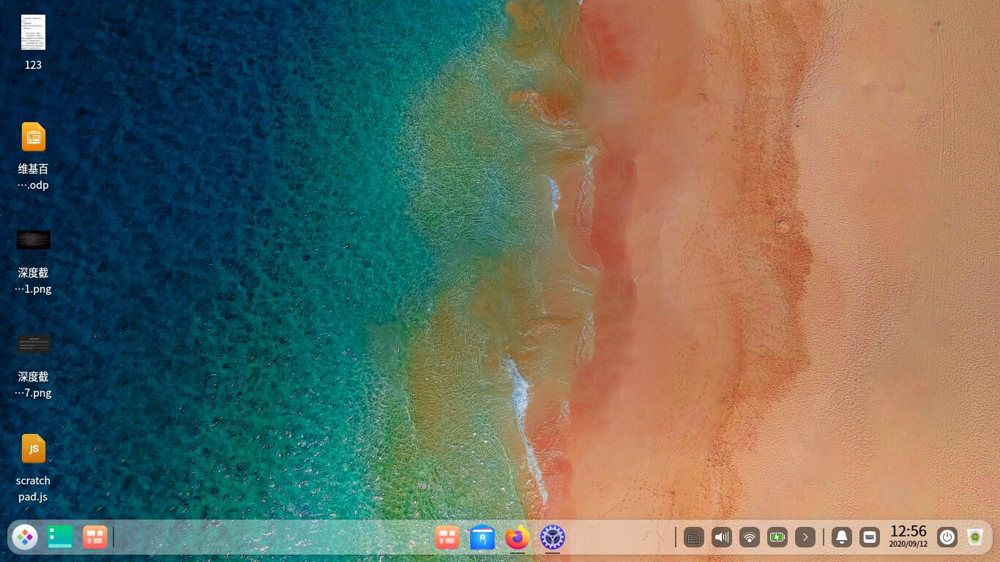

# 从Deepin 15.11升级到Deepin 20之路

上周六，我一直在用的Linux发行版Deepin发布了20正式版。从Deepin 15到Deepin 20中间是跳了版本了，据说这是Google带来的不良习气，跳版本。虽然是跳了版本，但这两个版本之间的跨越也是很大的。在一片骂声中，我还是要用一用我们的国产深度操作系统的。



我用了一天左右的时间才真正平滑升级到20，可以说并不是十分一帆风顺。这次官方并没有给我们推送更新，但在论坛里面，已经很快就有了从15.11升级到20的套路，而且有人升级成功了。但根据我的经验，Deepin发新版本的测试往往并不是特别充分，往往在有一些问题的状况下就发版了。但一般来说不会有重大的问题。

下面我将从我的角度来介绍一下我升级的历程。总体来说是根据官方的[更新公告](https://bbs.deepin.org/forum.php?mod=viewthread&tid=198112)：

>- 将15.11官方源替换成20官方源（/etc/apt/sources.list）deb [by-hash=force] https://community-packages.deepin.com/deepin/ apricot main contrib non-free
>- 新增20官方商店源（/etc/apt/sources.list.d/appstore.list ），无list文件创建后添加：deb https://community-store-packages.deepin.com/appstore eagle appstore

注意一定要改成https。我一开始改的时候只改了网址，没有加https，结果全告诉我[Ign]也就是忽略掉了。

设置好这个基本上就可以运行下面这两条命令了

```bash
sudo apt update
```

更新apt缓存，然后

```bash
sudo apt full-upgrade
```

大概半个小时后，虽然看似完成了，但是报了几个错。我尝试再次更新，依然报那几个错。

```
正在设置 deepin-authenticate (1.1.0.8-1) ...
mv: 无法获取'/lib/deepin-authenticate/common-auth-temp' 的文件状态(stat): 没有那个文件或目录
dpkg: 处理软件包 deepin-authenticate (--configure)时出错：
已安装 deepin-authenticate 软件包 post-installation 脚本 子进程返回错误状态 1

dpkg: 依赖关系问题使得 dde-session-shell 的配置工作不能继续：
dde-session-shell 依赖于 deepin-authenticate (>= 1.0.0.2)；然而：
  软件包 deepin-authenticate 尚未配置。

dpkg: 处理软件包 dde-session-shell (--configure)时出错：
依赖关系问题 - 仍未被配置
dpkg: 依赖关系问题使得 dde-session-ui 的配置工作不能继续：
dde-session-ui 依赖于 dde-session-shell；然而：
  软件包 dde-session-shell 尚未配置。

dpkg: 处理软件包 dde-session-ui (--configure)时出错：
依赖关系问题 - 仍未被配置
dpkg: 依赖关系问题使得 dde 的配置工作不能继续：
dde 依赖于 dde-session-ui；然而：
  软件包 dde-session-ui 尚未配置。

dpkg: 处理软件包 dde (--configure)时出错：
依赖关系问题 - 仍未被配置
在处理时有错误发生：
deepin-authenticate
dde-session-shell
dde-session-ui
dde
E: Sub-process /usr/bin/dpkg returned an error code (1)
```

我用的纯文本tty界面安装的，所以显示是英文，但意思是和上面一致的。遇到这个问题以后，我天真地以为自己可以顺利解决，所以就没有仔细搜索论坛，也是因为Deepin的论坛太难搜索了，搜不到想要的东西。

我一看，这不就是没有common-auth-temp这个文件吗？我就新建了个空白文件。

```bash
sudo mkdir /lib/deepin-authenticate
sudo touch /lib/deepin-authenticate/common-auth-temp
```

然后补充安装

```bash
sudo dpkg --configure -a
```

正如[此帖](https://bbs.deepin.org/forum.php?mod=viewthread&tid=200655)中的情形一样，

> 重启后遇到问题：
>  1、登陆界面本来要输入密码的，结果直接进入了系统。
>  2、锁定屏幕后，登陆按钮一直闪，无法输入密码，关机按钮也无响应，只能强制关机。
>  3、打开终端，输入sudo apt update，提示：
>  对不起，请重试。
>  对不起，请重试。
>  sudo: 3 次错误密码尝试

由于我一通改密码，进入系统之后还需要手动输入密码解锁密钥环。我尝试进入启动项中的UOS Recovery重置密码，结果没效果，重置的密码也没生效。

不过还好这篇博客中有解决方案，那就是[另一个帖子](https://bbs.deepin.org/forum.php?mod=viewthread&tid=200425&page=1#pid763880)，这位withcourageto大佬的方案应该才是对的。我们现在唯一能做的就是修复pam。PAM的意思是**可插拔认证模块**（Pluggable Authentication Modules ），感兴趣的同学可以了解细节。我们的问题就在于建了一个空的common-auth-temp文件，而我们后续更新配置的时候，是拿这个空的文件当参考更新的pam，所以导致我们登录的时候出现各种问题。

然而，由于需要ROOT权限，而我们无论sudo任何东西都会立刻提示失败，连输密码都不让我们输，怎么办呢？只能上终极大招，recovery模式了。recovery模式是一个强大的模式，它可以让我们直接进入root用户，进行一些修复操作。在忘记root密码的时候，也常常需要用到这个方式来解决。

在Deepin的Grub菜单里，我们发现竟然没有Recovery模式，这与众多教程都不一样。事实上根据我的经验，直接在菜单按e键就好了，不需要什么选中Recovery模式，就可以进入编辑启动模式。编辑框大概写的就像下面这样

```
setparams 'Deepin GNU/Linux, with Linux 5.4.0-26-generic (recovery mode)'

  load_video
  insmod gzio
  ...
  set root='hd0,msdos1'
  ...
  linux /boot/vmlinuz-5.4.0-26-generic root=<uuid> ro recovery nomodeset
  echo  'Loading initial ramdisk ...'
  initrd /boot/initrd.img-5.4.0-26-generic
```

框外面还会有几行字

```
Minimum Emacs-like screen editing is supported. TAB lists completions.
Press Ctrl-x or F10 to boot, Ctrl-c or F2 for a command-line or ESC to
discard edits and return to the GRUB menu.
```

大意就是，这个编辑框可以想Emacs那样编辑，<kbd>TAB</kbd>按钮会列出补全选项。按<kbd>Ctrl</kbd>+<kbd>X</kbd>或者<kbd>F10</kbd>就会启动，<kbd>Ctrl</kbd>+<kbd>C</kbd>或者<kbd>F2</kbd>开启一个命令行，按<kbd>ESC</kbd>放弃修改并返回GRUB菜单。

我们要做的就是把`ro recovery nomodeset`改成

```
rw single init=/bin/bash
```

一定注意前面是rw，不然你会进入一个只读的环境，什么文件都不能改。虽然是root看着挺爽，但是啥都不能改不也尴尬嘛。好啦，正确修改之后按<kbd>F10</kbd>就好了。我也想按<kbd>Ctrl</kbd>+<kbd>X</kbd>啊，但咱的垃圾ASUS电脑它的键盘芯片并非标准接口，在Deepin里面我用驱动修复了<kbd>Ctrl</kbd>键的检测，但在GRUB这里不行啊。

启动之后按照上面帖子说的，把/etc/pam.d/common-auth这个文件改成下面这样

```
auth    [success=1 default=ignore]      pam_deepin_authentication.so user_locale=.config/locale.conf timeout=-1
auth    requisite                       pam_deny.so
auth    required                        pam_permit.so
```

然后按<kbd>Ctrl</kbd>+<kbd>Alt</kbd>+<kbd>Del</kbd>或者输入reboot重启就会发现，所有问题都消失了。

最后，可以清理一下系统残存的文件，把升级后v20不用的残存软件清一清就好了。整体体验是不错的，虽然有些人表示不喜欢圆角，但我个人觉得挺有爱的，主要是配色上我觉得下工夫了。就比如这个文本编辑器，我觉得就好看多了


这次升级主要让我学习了一下用recovery模式，还是很有收获的。[∎](../ "返回首页")