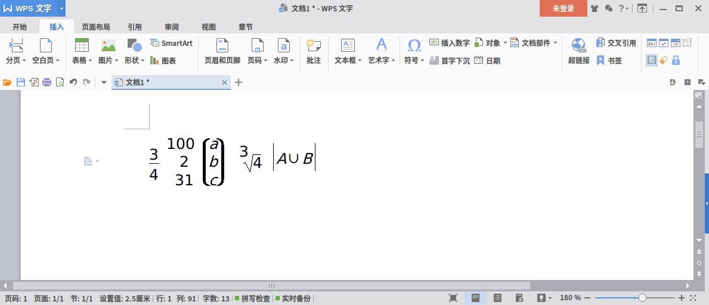

# 我换Linux操作系统了

其实我想用Linux系统很久了，但是一直由于留恋Windows上诸多软件的便利，而没有彻底换用Linux。其实这是可以理解的。大学的时候，如果要交个什么作业，往往就要用到Windows上的工具。编程还好说，关键是有些学科的“御用”软件没有Linux版本，这就阻碍了我们使用Linux。不过，这一切，在我工作以后都发生了变化。

工作之后，家里的电脑用得越来越少了。可以说，在家里，电脑成了“生活专用”物品，不再像以前那样，是一件学习工作用途物品。既然不再需要用它来应对“紧急任务”，那么就可以想怎么搞就怎么搞了。但如果Linux没有优势的话，我也不必换过来而不讨好。虽然如此，我还是不太建议日常操作Windows都不熟的人换的，因为Linux毕竟还是有诸多不方便。

Linux的分支版本琳琅满目，如果你没接触过Linux可能不了解这一点。挑选Linux版本就像你去商场挑选一件衣服一样。我挑了Deepin Linux，大多数中国小白都会挑选的一种Linux。要说挑选过程嘛，其实可以说，是从没上大学挑到现在的。之前在虚拟机，或是物理机，先后尝试过Fedora、Ubuntu、Trisquel、LMDE[^lmde]等等。可以说一个版本一个样。经常听到有人说，Linux的版本太多了，开源社群又是自愿性质，力量又被分散了，因此很人性化的版本。有些版本稳定是稳定，但配置起来不方便。大家对Ubuntu趋之若鹜，看多了，也会觉得审美上有点单一。我这次的选择，纯粹是从易用性考虑，并不是说我不会配置那堆东西，不过在家用，还是喜欢上手就能用的。而且，支持QQ和一些Windows软件是加分点。如果为了Linux而抛弃QQ[^qq]的便利性，可能会让人犹豫要不要换。但现在，不需要考虑了。

选Linux版本还有很多细节，我就不赘述了。我要继续说的是，装上Linux以后纠结的事情。事情之一就是用什么文字处理软件。Deepin默认装上了我国骄傲的WPS Linux 2016，但不得不说，功能不全。作为一个工科生，数学爱好者，是不能允许文字处理软件连数学公式都不能处理的。要说WPS Linux一点公式处理能力也没有，那是瞎说，但是真的是薄弱。你可能想象不到，下面几个公式是怎样艰难地用一种叫做“域代码”的东西敲出来的。同样，LibreOffice的公式处理也惨不忍睹，如果用过的相信印象深刻:smile:。所以我积极寻找替代品。其中一个就是我现在用来写这篇文章的Typora。Typora是一款WYSIWYG的Markdown编辑器，虽然依然是敲代码，但不用一直面对代码，还是会给人带来良好的感受的。

如果Typora只是一款markdown编辑器可能还是不够吸引我，但它支持公式，还支持PDF输出这两点让我赏识。Markdown毕竟还是极客们用的比较多，我们公司（可以说是一个比较传统的公司吧）居然很少有人用Markdown。而PDF就是一种面向纸张的，可以精美地印出来的东西。我们随便打一个公式做例子：
$$
\Delta f = \frac{\partial^2 f}{\partial x^2 } + \frac{\partial^2 f}{\partial y^2 } + \frac{\partial^2 f}{\partial z^2 } = 0
$$
上面的公式是拉普拉斯方程。Typora采用成熟的MathJax来渲染公式，也是我所希望的。我知道大家进Linux都喜欢玩玩$\LaTeX$体验一下印刷质量的公式。我也用过LaTeX，配置各种宏包，不亦乐乎，但似乎不是真正省时省力的工具，而且TeX最小安装也要好大，我觉得其实公式用TeX标准就够了，维基百科也是类似这样做。其他文字用轻便的Markdown或者其他标记就好。

Linux会带给你一种感受就是，所有软件是互相依存的。尤其是一些核心的工具，是生成或者运行其他应用的必备。而在Windows里面，软件会努力让你感觉是独立存在的。只要你有一个完整的Windows，再不行装上最新的.net，若干配置好的dll随那些软件调用。软件如果自己需要用到一些库或者工具的时候怎么办呢？Windows上通常就会直接把那些打包好的库堆到软件的安装目录下。于是就会有这样有趣的现象：A软件用了python，文件夹里放一份python；B软件用了python，又在B的文件夹放一份python。你要在Linux下的话，会发现他们都用中央的一份python。不过这样也有一些令人烦的地方。那就是安装一个软件要先安装好它的依赖。但如果某个依赖下载不到了呢？可能就比较头疼了。一般是能下载到的，但不排除某个依赖在Debian的仓库（我们称作repo）里有，但是在你用的Linux的仓库里就是没有，你怎么办。装软件不再是点击setup.exe，一键安装。虽然大多数时候，往往也就是一行命令。

在Linux上，你会觉得许多开源软件运行得很流畅，或者说比Windows的占用小。我想这是因为它们最初都是在Linux下开发的，发展到一定程度才考虑port（移植）到Windows环境下。一些从一开始就考虑到跨平台的软件一般不会有这种问题。不过很多Linux的软件我也还没用习惯，还要多多磨合。我也希望Linux上的软件更加好用，让更多的人能够尝试一下，不要让他们遇到太多困难。

最后分享一些我用到过的Linux下Windows软件的替代品吧，顺便测试一下表格功能：

| Windows下软件    | Linux下的替代软件            |
| ---------------- | ---------------------------- |
| Microsoft Office | WPS Office Linux、TeX        |
| Photoshop        | GIMP                         |
| Notepad++        | Gedit、nano                  |
| QQ               | Deepin QQ                    |
| 腾讯软件管家     | 应用商店、新立得（Synaptic） |
| 谷歌日语输入法   | Anthy                        |
| 写字板           | Typora                       |
| 各类垃圾清理软件 | BleachBit                    |
| 杀毒软件         | Linux几乎不需要              |
| MATLAB           | Scilab、Octave               |
| 迅雷             | aria2                        |

还有很多我就不一一列举了。我所谓的替代不意味着格式兼容，只要我觉得功能上能够替代就好了。如果你觉得Linux还行，那就试试呗。不过有句话我要说清，完全安装Linux与双系统比起来，肯定前者要容易；如果你真打算做双系统，一定拿U盘做个PE，随时准备修复引导。如果你装到一半就等不及了，强行关机的话，很有可能哪个系统也进不去喔。就说到这里吧。[∎](../ "返回首页")

[^lmde]: 可能有人没听过，Linux Mint Debian Edition。Linux Mint是基于Ubuntu的，这个则是Debian内核的。
[^qq]: 对于有些人来说可能是微信

