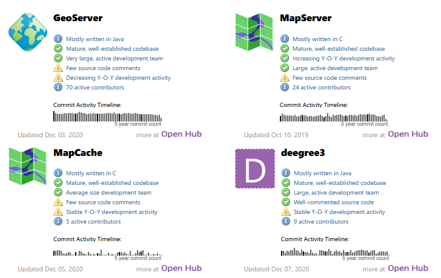

# Web GIS零基础入门

我基本上可以说是Web GIS零基础了。最近两个星期左右的时间，我努力学习这方面知识，终于有点点入门了。另外，最近我为公司设计图上呈现服务，主要就是关于Web GIS的，所以我也不得不恶补了两个星期的GIS相关的知识。在我学习的过程中，我也不断修改设计，而且也完善了一系列与这有关的维基百科条目。本文我主要想避开公司业务，谈一谈能够分享给大家的我这两周学到的东西。首先还是先给大家看看Web GIS的维基介绍。

> **网络地图服务**是指使用网络上的地理信息系统（GIS）提供的地图的过程。**网络地图**或**在线地图**既可以服务也可以消费，因此网络地图不仅仅是网络制图，它是一种消费者可以选择地图将显示什么的服务。Web GIS强调的地理数据处理方面更多的是涉及到数据采集等设计方面和数据存储、算法等服务器软件结构，而不是终端用户报告本身。

很多人喜欢把Web与GIS连在一起，但其实是错误的用法，应当分开成两个单词。关于Web GIS有很多概念，我不想一股脑地列出来，让我们逐步来揭开Web GIS的面纱。Web GIS相关知识的中文资料亦有不少，我尤其要推荐的就是[OSGeo中国中心](https://www.osgeo.cn/)这个网站，它是全中文的，是由国家遥感中心发起、Autodesk中国有限公司协助，经OSGeo正式授权的非营利性组织。这个网站上不光有开源GIS的学习资料，还有开源GIS，如GeoServer、MapServer的中文文档。

既然Web GIS服务，那它就一定跟桌面GIS软件有所区别。它们本质上虽然都是GIS，但Web GIS的用户群体更多属于非专业的用户。他们没有专业的地理知识，他们使用Web GIS的主要目的是借助地图获取相关的地理信息。Web地图相对于传统地图的优势在于可交互性。好了不多说废话了，聊点实在的技术吧。

要搭建一套Web GIS系统，其实无非就是前端、后端、数据库嘛。把这三者都搞定了，基本上就可以搞定一个简单的GIS系统了。下图就是一个结合 Google 和网页功能的地理信息系统示例架构图。（图片来自维基共享资源，CC BY-SA）


## 开源地图前端以及与地图服务对接

常用的开源GIS前端有Leaflet、OpenLayers、Maptalks。其中Maptalks虽然名气不大，但是很好用，这里推荐一下。使用开源GIS前端的好处在于以不变应万变。后端怎么变，我前端实现基本功能做的事情几乎都是相同的：对接瓦片接口，然后大部分开源前端附带的效果就都有了。世界就应该是这样，简单明了。虽然事实上，各个商业GIS后端实现各种各样的接口，还有附带JS API，但我的观点是那些东西能不用就不用。

经常有码农抱怨，“别出新技术了，我学不动了”之类。我认为不同厂商在自我陶醉于整自己一套API的时候，不妨想一下，为何不直接扔给对方一套用Leaflet或者Openlayers对接的例子呢？其实对于大多数事面上的使用来说，只对接瓦片就足够了。那些本来用通用前端就能实现的功能，已经不需要服务器端再去折腾半天叠加到图像上了。所以我心目中，GIS的最简单配置就是Leaflet对接上一个瓦片缓存结束。没有那么多乱七八糟的。

当然，有些功能必须后端实现。什么功能呢？我认为就是那些涉及到前端没有呈现的数据的地方。比如地理信息的过滤、搜索、路线规划等。前端没有那么多视图区域以外的信息，这些信息是存储在上图中的Datastores里面的，可能需要GIS服务器的再次加工，才可以返回前端使用。

既然说到瓦片，那我们就要聊一下瓦片的标准协议了，那就是WMTS，全称叫做Web地图瓦片服务。这个标准出来之前其实缓存瓦片在地图服务里面已经是非常常见的操作了。常见的变体是TMS瓦片协议，它是WMTS的前身，选取的坐标原点和坐标的方向于WMTS不同。在Leaflet中，只要打开tms这个参数，就会按照TMS的规则获取瓦片。另外在XYZ瓦片协议里面，也有z/x/y和z/y/x两种不同的顺序，ArcGIS就是z/y/x的顺序，需要注意一下。一般来说，按照这些，就可以应付市面上90%的地图了。如果倒霉需要对接特别的切图方式的，那实在不行就直接用人家的JS API吧。

搞地图还需要稍稍了解一下地图投影的相关知识。但也不用了解太深。首先是基础概念（来自维基百科）

> 地图投影，是指按照一定的数学法则将地球椭球面上的经纬网转换到平面上，使地面的地理坐标 $(\phi ,\lambda )$ 与平面直角坐标 $(x,y)$ 建立起函数关系，投影的一般公式为 $\begin{cases}x=f_{1}(\phi ,\lambda )\\y=f_{2}(\phi ,\lambda )\end{cases}$，这是绘制地图的数学基础之一。

我们买到的普通的地图，也都是投影的结果。因为地球表面本身是三维的，不能直接在二维平面上绘制，就需要进行投影。Web地图本质上也是地图，当然也要进行投影。常见的地图投影如下：

| ESPG标识码 | 正式名称                 | 含义                                       |
| ---------- | ------------------------ | ------------------------------------------ |
| EPSG:3395  | WGS 84 / World Mercator  | 真正的墨卡托投影，椭球面形式，拥有保角特性 |
| EPSG:3857  | WGS 84 / Pseudo-Mercator | Web墨卡托投影，在线地图常见投影            |
| EPSG:4326  | WGS 84                   | 世界大地测量系统1984，在GPS中使用          |

其中，我国首个官方免费地图服务“天地图”中的地图一半用到的就是球面墨卡托（EPSG:3857）和经纬度投影（CGCS2000，厘米级兼容EPSG:4326）。Leaflet理所当然地默认选择Web墨卡托，因为几乎所有在线地图都是这个投影法。但是在对接专网的时候，我发现CGCS2000才是主流。

此外，如果你对接互联网上的地图的时候，你还需要关注坐标是不是有偏的问题。我国互联网上的地图几乎都是有偏的。这个原因是“中华人民共和国测绘限制”。他们这些这些地图虽然也用球面墨卡托，但他们用的坐标系是经过混淆算法处理的。GCJ-02（官方称**地形图非线性保密处理算法**，俗称**火星坐标系**）这种坐标系统在中国非常常用的坐标系。根据经验，这种混淆带来的偏差大概在50m左右。如果大家获取的坐标与地图的坐标系不一样，直接在地图上标点的话，就会出现偏移的现象。即便是使用国外的Google地图，由于Google地图从2006年以来从高德公司获取地图信息，所以依然是有偏的。由于OpenStreetMap是志愿者根据卫星图描出来的，所以没有偏移的现象。

### 矢量地图图层

有人可能想到了矢量地图图层。矢量图层和栅格图层是地图图层的两大类。它们的对接方法是完全不一样的。在若干年前，矢量图层都是由地图后端预先生成之后返给前端的。不管是ESRI的Shapefile也好，GML也好，都是给服务器端（或者客户端）用的。但随着现在普通个人电脑的硬件升级，浏览器WebGL相关技术的实现，就可以考虑把矢量渲染这项工作下放到浏览器端了。

后端生成这种确实可以利用后端的硬件优势，以及直接访问数据的权限，加快矢量图的渲染，但这也降低了前端的扩展性。不说那么多背景。说一下现在矢量地图图层常用的格式。GeoJSON、Mapbox Vector Tile（MVT）这两个是最常见的矢量图层格式。GeoJSON几乎是所有开源前端都支持的一种格式，也是大家几乎都会接触到的一种格式。GeoJSON的表现力有限，但足够现代化，你要知道JSON就是比XML现代化。为什么？因为前端JS可以直接读取JSON啊，你想要给前端用就要用JSON啊。所以我就非常喜欢GeoJSON。但你如果想要完全用矢量数据生成一张地图，那当前开源界似乎只有MVT了。Mapbox GL JS是最成功的一个案例，它不是一个简简单单的呈现库，它附带了多项算法，就是为了优化矢量图层的生成，其中就有著名的“道格拉斯-普克算法”。国内一些小公司做矢量地图几乎无一例外地在开源Mapbox基础上略作修改，就成现成的产品了。当然，这也方便了我们对接，直接拿mapbox的对接库去对接，碰碰运气，说不定就对上了。

矢量图层由于是前端动态绘制，有一个天然的优势就是可以自由地处理地图的样式。想让地图一些要素不可见也非常容易。而且不必给后端发请求去动态过滤需要的要素（传统地图实现此功能就需要这样了）。不过Mapbox最近有些让我不爽，因为Mapbox GL JS的协议从BSD-3-Clause切换到了一个不怎么自由的Mapbox Terms of Service。使用它的库还需要注册Mapbox帐号，即便你用根本不是Mapbox的地图，你只不过是用它的JS去接一个符合它规范的地图，比如OpenMapTiles。如果大家想用真正免费的矢量瓦片的话，可以看看[这里](https://osmlab.github.io/osm-qa-tiles/)，这是人文主义OSM团队提供的，有区分国家版本。不过提醒你，你下载到中国地图会没有台湾和所有争议地区。这一点如果是正规用途肯定是不行的，个人玩玩还好。

## 地图后端

事实上我对于地图后端的了解是不够多的。主要是因为大多数情况，大家只要对接互联网上免费的，或者别的公司提供的地图服务就好了，不需要自己搭建地图服务器。

但为了完整性，我还是介绍一下我了解到的地图后端的相关知识，给大家参考。以下列举几个成熟的地图服务，



这是OSGeo上排名前几的地图服务器。最好的两个选择是GeoServer与MapServer。前者优势是Java开发，符合产品线技术栈；后者用C语言实现，比前者快。

#### 自行构建地图后端的可能性

由于瓦片服务实现相对容易，这就为我们自行构建地图后端提供了可能性。我尝试用Nginx+Lua访问本地图片构建了一个简单的实现

```lua
local level = string.format('L%02d', tonumber(ngx.var[1]))
local r_str = string.format('R%08X', tonumber(ngx.var[2]))
local c_str = string.format('C%08X', tonumber(ngx.var[3]))
local file, err = io.open([[/path/to/tile/]] .. level .. '/' .. r_str .. '/' .. c_str .. '.jpg', 'rb')
if not file then
    ngx.log(ngx.ERR, "open file error:", err)
    ngx.exit(ngx.HTTP_SERVICE_UNAVAILABLE)
end

ngx.say(file:read('*all'));
file:close();
```

这个实现旨在独立提供GIS瓦片服务。使用开源前端Leaflet测试过可以正常使用。另外，自行构建的地图天然就支持多种架构，ARM架构也可以轻松部署，而且较为轻便，所以也是可以考虑的一个选项。

Web GIS领域还有很多很多知识，我只是开个头，让大家有个初步的认识。如果想要深入了解，还是推荐大家去[OSGeo中国中心](https://www.osgeo.cn/)网站看看咯。希望这篇博客对大家有帮助。[∎](../ "返回首页")